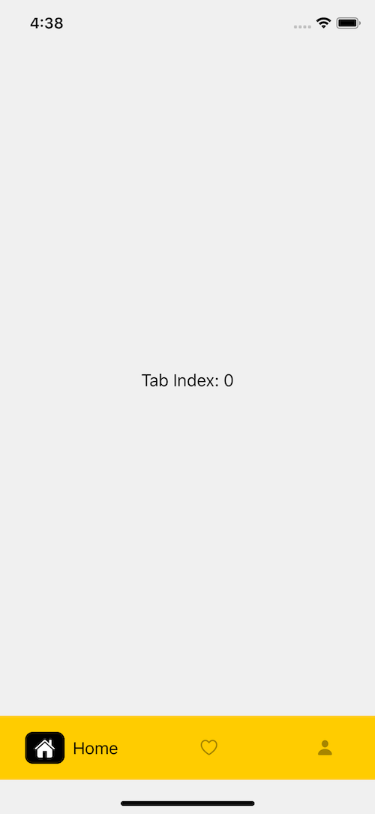
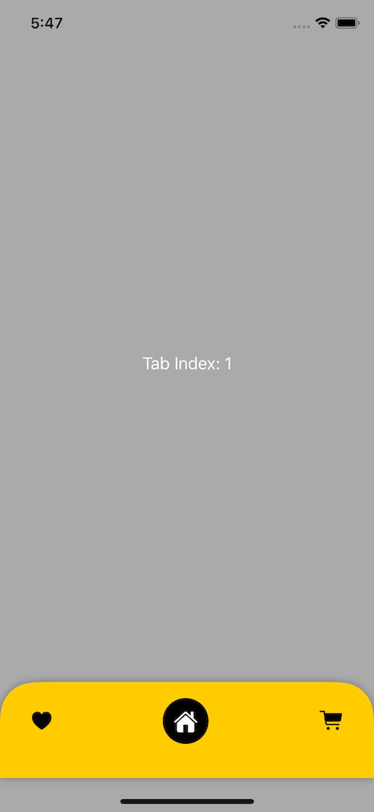
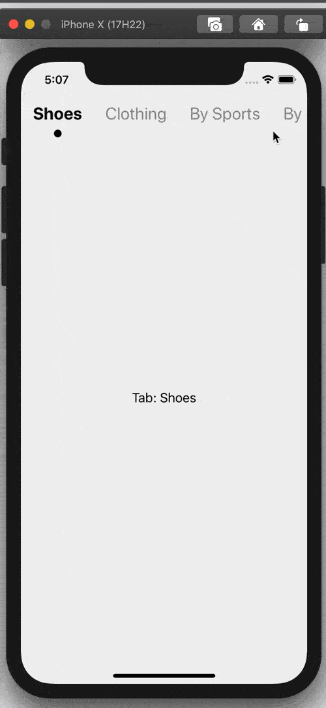
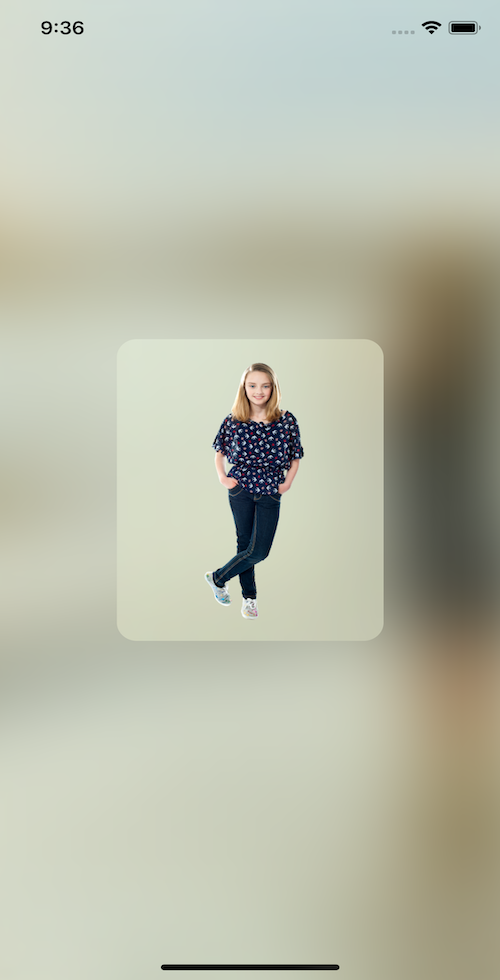

# Awesome SwiftUI

- A list of awesome [SwiftUI Framework](https://developer.apple.com/documentation/swiftui) collection. 

# User Interface

### [Views and Controls](user-interface/views-and-controls)

**Dismiss Keyboard When Tap Outside** | **BlurBackgroundImage** | **Coming soon...**
:--:|:--:|:--:|
 |  | 
**Coming soon...** | **Coming soon...** | [**More...**](user-interface/views-and-controls)
 |  | [View More...](user-interface/views-and-controls)

### [View Layout and Presentation](user-interface/view-layout-and-presentation)

**CustomTabView-1** | **CustomTabView-2** | **MenuTopBar**
:--:|:--:|:--:|
 |  | 
**Coming soon...** | **Coming soon...** | [**More...**](user-interface/view-layout-and-presentation)
 |  | [View More...](user-interface/view-layout-and-presentation)
    
### [Drawing and Animation](user-interface/drawing-and-animation)

**Shape [.topLeft, .topRight]** | **Coming soon...** | **Coming soon...**
:--:|:--:|:--:|
[![Shape [.topLeft, .topRight]](user-interface/drawing-and-animation/preview/Shape.png)](user-interface/drawing-and-animation/essentials/Shape.swift) |  | 
**Coming soon...** | **Coming soon...** | [**More...**](user-interface/drawing-and-animation)
 |  | [View More...](user-interface/drawing-and-animation)

### [Framework Integration](user-interface/framework-integration)

**UITextView** | **UIVisualEffectView** | **UIActivityIndicatorView**
:--:|:--:|:--:|
 |  | 
**UIImagePickerController** | **PHPickerConfiguration** | [**More...**](user-interface/framework-integration)
 |  | [View More...](user-interface/framework-integration)

# Data and Events

### [State and Data Flow](data-and-events/state-and-data-flow)

**DarkModeToggle** | **Coming soon...** | **Coming soon...**
:--:|:--:|:--:|
 |  | 
**Coming soon...** | **Coming soon...** | [**More...**](data-and-events/state-and-data-flow)
 |  | [View More...](data-and-events/state-and-data-flow)

### [Gestures](data-and-events/gestures)

# Previews in Xcode

### [Previews](previews-in-xcode/previews)

# Find me on:

- [GitHub](https://github.com/duonghominhhuy) and [Twitter](https://twitter.com/duonghominhhuy)
- Website: [https://codepassion.dev](https://codepassion.dev)
- Facebook: [https://fb.com/codepassion.dev](https://www.facebook.com/codepassion.dev)

