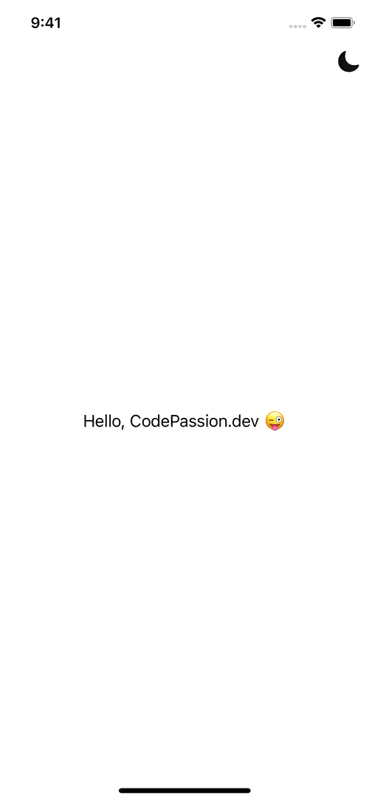
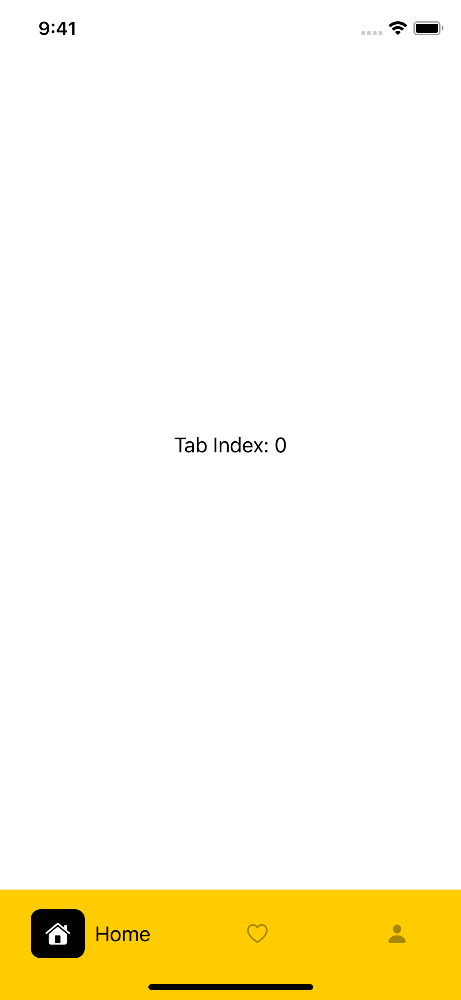
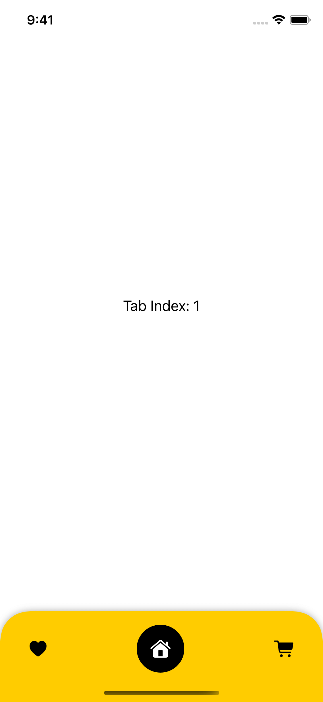
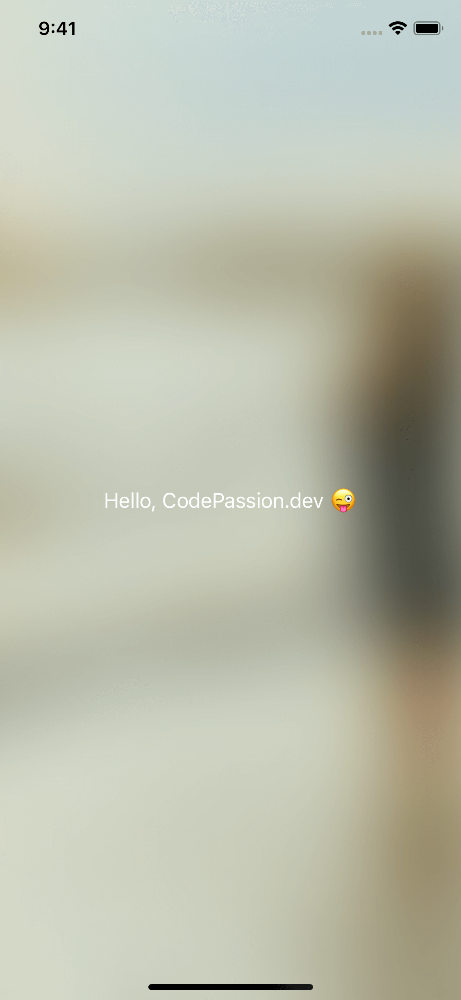
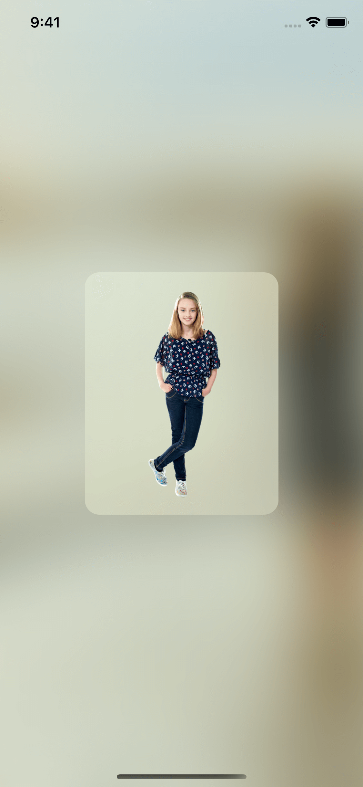
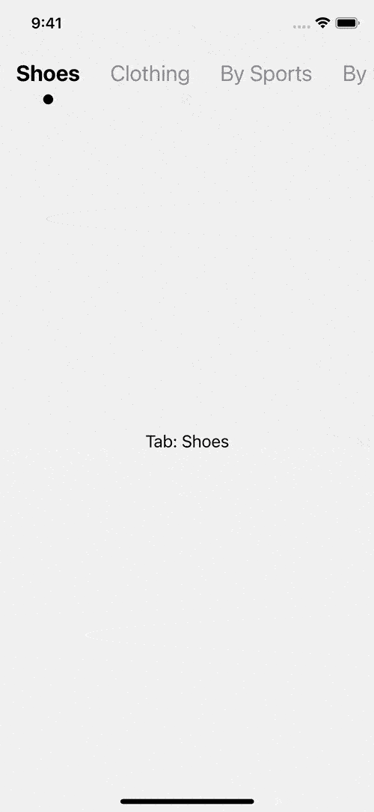
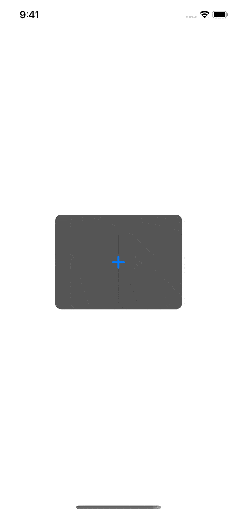
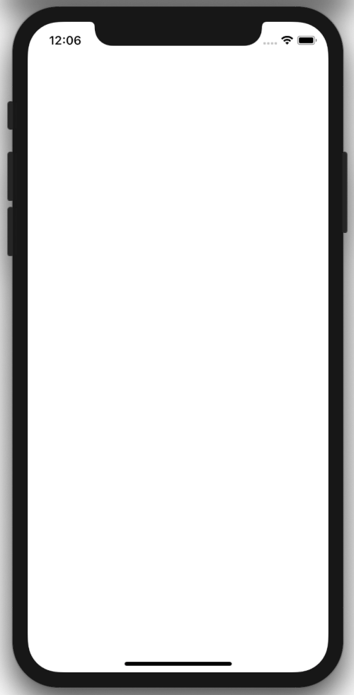
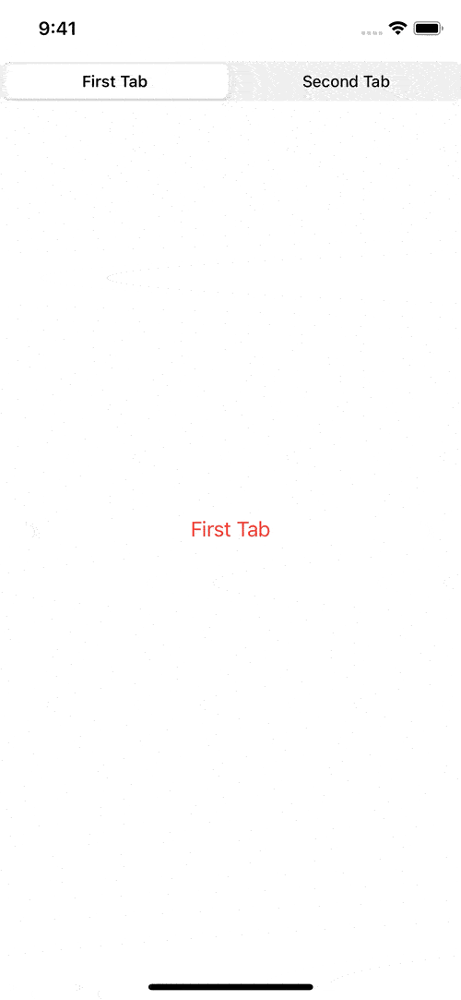

# Awesome SwiftUI

- A list of awesome [SwiftUI Framework](https://developer.apple.com/documentation/swiftui) collection. 
- UI categories based on the [Human Interface Guidelines](https://developer.apple.com/design/human-interface-guidelines/).
- Click on each screenshot to see example code.

# Table of Contents

<!--
- App Architecture
    - [Launching](#launching)
    - [Onboarding](#onboarding)
    - [Loading](#loading)
    - [Modality](#modality)
    - [Navigation](#navigation)
    - [Requesting Permission](#requesting-permission)
    - [Settings](#settings)
- [User Interaction](#user-interaction)
    - [3D Touch](#3d-touch)
    - [Apple Pencil and Scribble](#apple-pencil-and-scribble)
    - [Audio](#audio)
    - [Authentication](#authentication)
    - [Data Entry](#data-entry)
    - [Drag and Drop](#drag-and-drop)
    - [Feedback](#feedback)
    - [File Handling](#file-handling)
    - [Game Controllers](#game-controllers)
    - [Gestures](#gestures)
    - [Haptics](#haptics)
    - [Near Field Communication](#near-field-communication)
    - [Pointers (iPadOS)](#pointers-ipados)
    - [Undo and Redo](#undo-and-redo)
- [System Capabilities](#system-capabilities)
    - [Augmented Reality](#augmented-reality)
    - [Home Screen Actions](#home-screen-actions)
    - [Multitasking](#multitasking)
    - [Multiple Windows](#multiple-windows)
    - [Notifications](#notifications)
    - [Printing](#printing)
    - [Quick Look](#quick-look)
    - [Ratings and Reviews](#ratings-and-reviews)
    - [Screenshots](#screenshots)
    - [TV Providers](#tv-providers)
    - [Widgets](#widgets)
-->

- [Visual Design](#visual-design)
[//]: #    - [Adaptivity and Layout](#adaptivity-and-layout)
[//]: #   - [Animation](#animation)
[//]: #    - [Branding](#branding)
[//]: #    - [Color](#color)
    - [Dark Mode](#dark-mode)
[//]: #    - [Launch Screen](#launch-screen)
[//]: #    - [Materials](#materials)
[//]: #    - [Terminology](#terminology)
[//]: #   - [Typography](#typography)
[//]: #   - [Video](#video)

<!--
- [Icons and Images](#icons-and-images)
    - [Image Size and Resolution](#image-size-and-resolution)
    - [App Icon](#app-icon)
    - [System Icons](#system-icons)
-->

- [Bars](#bars)
[//]: #   - [Navigation Bars](#navigation-bars)
[//]: #   - [Search Bars](#search-bars)
[//]: #    - [Sidebars](#sidebars)
[//]: #   - [Status Bars](#status-bars)
    - [Tab Bars](#tab-bars)
[//]: #   - [Toolbars](#toolbars)

- [Views](#views)
[//]: #    - [Action Sheets](#action-sheets)
[//]: #    - [Activity Views](#activity-views)
[//]: #    - [Alerts](#alerts)
[//]: #   - [Collections](#collections)
[//]: #    - [Image Views](#image-views)
[//]: #    - [Pages](#pages)
[//]: #    - [Popovers](#popovers)
    - [Scroll Views](#scroll-views)
[//]: #    - [Split Views](#split-views)
[//]: #    - [Tables](#tables)
    - [Text Views](#text-views)
[//]: #  - [Web Views](#web-views)

- [Controls](#controls)
[//]: #   - [Buttons](#buttons)
[//]: #   - [Color Wells](#color-wells)
[//]: #    - [Context Menus](#context-menus)
[//]: #   - [Edit Menus](#edit-menus)
[//]: #   - [Labels](#labels)
[//]: #   - [Page Controls](#page-controls)
    - [Pickers](#pickers)
    - [Progress Indicators](#progress-indicators)
[//]: #    - [Pull-Down Menus](#pull-down-menus)
[//]: #    - [Refresh Content Controls](#refresh-content-controls)
    - [Segmented Controls](#segmented-controls)
[//]: #   - [Sliders](#sliders)
[//]: #   - [Steppers](#steppers)
[//]: #    - [Switches](#switches)
    - [Text Fields](#text-fields)

<!--
- [Extensions](#extensions)
    - [Custom Keyboards](#custom-keyboards)
    - [File Providers](#file-providers)
    - [Messaging](#messaging)
    - [Photo Editing](#photo-editing)
    - [Sharing and Actions](#sharing-and-actions)
-->

# [Visual Design](visual-design)

### [Dark Mode](visual-design/#dark-mode)

**DarkModeToggle** | **Coming soon...** | **Coming soon...**
:--:|:--:|:--:|
 |  | 
**Coming soon...** | **Coming soon...** | [**More...**](visual-design/#dark-mode)
 |  | [View More...](visual-design/#dark-mode)

# [Bars](bars)

### [Tab Bars](bars/tab-bars)

**CustomTabView-1** | **CustomTabView-2** | **Coming soon...**
:--:|:--:|:--:|
 |  |  
**Coming soon...** | **Coming soon...** | [**More...**](bars/#tab-bars)
 |  | [View More...](bars/#tab-bars)

# [Views](views)

### [Background](views/background)

**BlurBackgroundImage** | **UIVisualEffectView** | **Coming soon...**
:--:|:--:|:--:|
 |  | 
**Coming soon...** | **Coming soon...** | [**More...**](views/#background)
 |  | [View More...](views/#background)

### [Scroll Views](views/scroll-views)

**MenuTopBar** | **Coming soon...** | **Coming soon...**
:--:|:--:|:--:|
 |  | 
**Coming soon...** | **Coming soon...** | [**More...**](views/#scroll-views)
 |  | [View More...](views/#scroll-views)

### [Text Views](views/text-views)

**UITextView** | **Coming soon...** | **Coming soon...**
:--:|:--:|:--:|
 |  | 
**Coming soon...** | **Coming soon...** | [**More...**](views/#text-views)
 |  | [View More...](views/#text-views)

# [Controls](controls)

### [Pickers](controls/pickers)

**UIImagePickerController** | **PHPickerConfiguration** | **Coming soon...**
:--:|:--:|:--:|
 |  | 
**Coming soon...** | **Coming soon...** | [**More...**](controls/#pickers)
 |  | [View More...](controls/#pickers)

### [Progress Indicators](controls/progress-indicators)

**UIActivityIndicatorView** | **Coming soon...** | **Coming soon...**
:--:|:--:|:--:|
 |  | 
**Coming soon...** | **Coming soon...** | [**More...**](controls/#progress-indicators)
 |  | [View More...](controls/#progress-indicators)

### [Segmented Controls](controls/segmented-controls)

**SegmentedPickerStyle** | **Coming soon...** | **Coming soon...**
:--:|:--:|:--:|
 |  | 
**Coming soon...** | **Coming soon...** | [**More...**](controls/#segmented-controls)
 |  | [View More...](controls/#segmented-controls)

### [Text Fields](controls/text-fields)

**Dismiss Keyboard When Tap Outside** | **Coming soon...** | **Coming soon...**
:--:|:--:|:--:|
 |  | 
**Coming soon...** | **Coming soon...** | [**More...**](controls/#text-fields)
 |  | [View More...](controls/#text-fields)

# Find me on:

- [GitHub](https://github.com/duonghominhhuy) and [Twitter](https://twitter.com/duonghominhhuy)
- Website: [https://codepassion.dev](https://codepassion.dev)
- Facebook: [https://fb.com/codepassion.dev](https://www.facebook.com/codepassion.dev)
