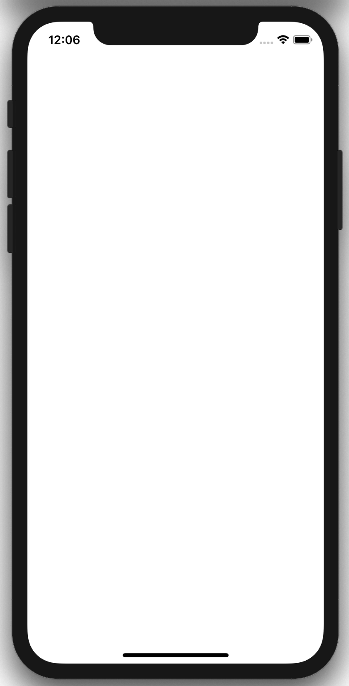
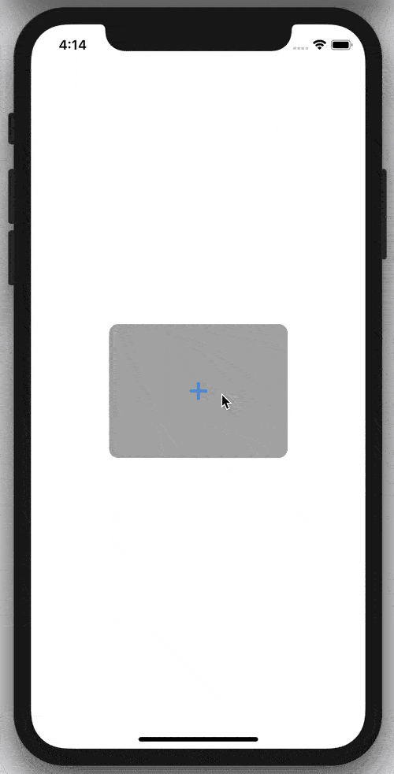

# Awesome SwiftUI - Framework Integration

# Essentials

### Interfacing with UIKit

**UIActivityIndicatorView** | **Coming soon...**     | **Coming soon...**
:--:|:--:|:--:|
 |  | 
**UIImagePickerController** | **Coming soon...**
 |  |

### Creating a watchOS App

- Coming soon...

# AppKit Hosting

### NSHostingController

- Coming soon...

### NSHostingView

- Coming soon...

### NSViewControllerRepresentable

- Coming soon...

### NSViewRepresentable

- Coming soon...

### NSApplicationDelegateAdaptor

- Coming soon...

# UIKit Hosting

### UIHostingController

- Coming soon...

### UIViewControllerRepresentable

- Coming soon...

### UIViewRepresentable

- Coming soon...

### UIApplicationDelegateAdaptor

- Coming soon...

# WatchKit Hosting

### WKHostingController

- Coming soon...

### WKUserNotificationHostingController

- Coming soon...

### WKInterfaceObjectRepresentable

- Coming soon...

### DigitalCrownRotationalSensitivity

- Coming soon...

### WKExtensionDelegateAdaptor

- Coming soon...

# Find me on:

- [GitHub](https://github.com/duonghominhhuy) and [Twitter](https://twitter.com/duonghominhhuy)
- Website: [https://codepassion.dev](https://codepassion.dev)
- Facebook: [https://fb.com/codepassion.dev](https://www.facebook.com/codepassion.dev)

