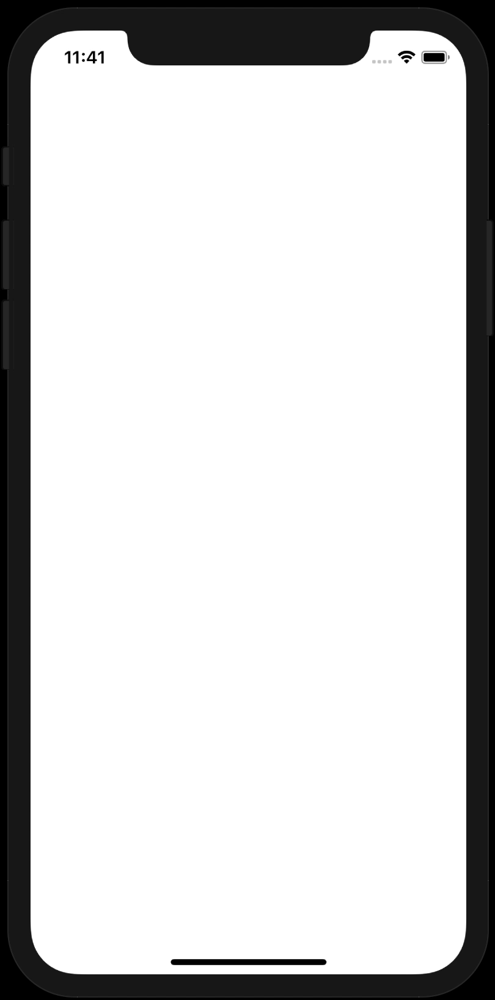

# Awesome SwiftUI - Interfacing with UIKit

### Visual Examples

**UIActivityIndicatorView** | **UIActivityIndicatorView**     | **UIActivityIndicatorView**
:--:|:--:|:--:|
 | [UIActivityIndicatorView](preview/UIActivityIndicatorView.gif) | [UIActivityIndicatorView](preview/UIActivityIndicatorView.gif)
**UIActivityIndicatorView** | **UIActivityIndicatorView**
[UIActivityIndicatorView](preview/UIActivityIndicatorView.gif) | [UIActivityIndicatorView](preview/UIActivityIndicatorView.gif) |

### Find me on:

- [Website](https://codepassion.dev)
- [GitHub](https://github.com/duonghominhhuy)
- [Twitter](https://twitter.com/duonghominhhuy)
- [Facebook](https://www.facebook.com/codepassion.dev)

